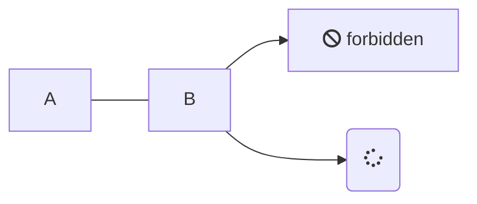
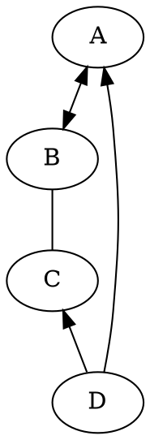

# Coding

[sidebar](_sidebar.md ":include")

> Java is excellent!


[filename](../_media/example.md ':include' )

[gist: script.js](https://gist.githubusercontent.com/anikethsaha/f88893bb563bb7229d6e575db53a8c15/raw/script.js ':include :type=code')

[filename](./UserCase.drawio ':include :type=code')



<!-- chat:start -->
#### **interviewer**
hello
#### **PPDebug**
hello world
<!-- chat:end -->



```tex
E = mc^2
```

