# 虚拟内存

虚拟内存提供了一种对主存的抽象概念,能够更加有效地管理内存且少出错.虚拟内存收硬件异常,硬件地址翻译,主存,磁盘文件和内核软件的完美交互,它为每个进程提供了一个大的一致的和私有的地址空间.

它具有三个功能:
* 将主存看成是一个存储在磁盘空间上的地址空间的高速缓存,在主存中只保存活动区域,并根据需要在磁盘和主存之间来回传送数据,高效地使用了主存.
* 为每个进程提供了一致的地址空间,从而简化了内存管理
* 保护了每个进程的地址空间不被其他进程破坏.

> TODO: 现在的应用程序感觉越来越大,它们是否是合理的使用虚拟内存来节省空间.

我们为什么需要学习虚拟内存:

虚拟内存是核心的,强大的以及危险的.

# 虚拟内存是如何工作的

## 物理和虚拟地址
* 物理地址：Physical Address, PA.将内存组织成Mge连续字节大小的单元组成的数组对应的下标。
* 虚拟地址: Virtual Address, VA. 应用所使用的空间地址。
* 内存管理单元: Memory Management Unit, MMU.将虚拟地址翻译成物理地址，一般使用专用硬件实现。

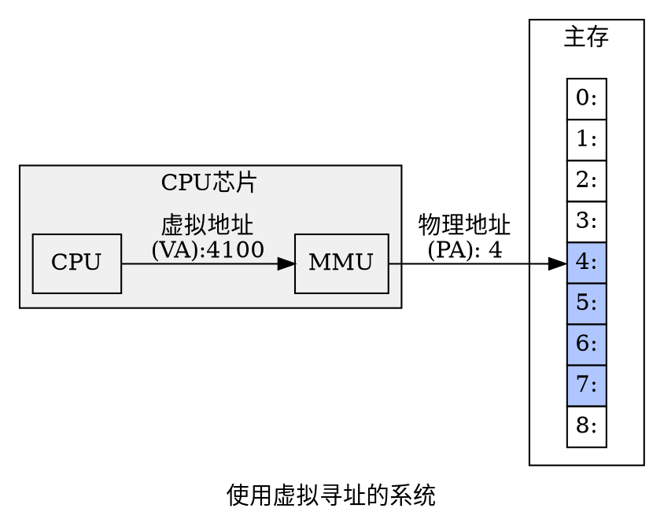

## 地址空间
* 地址空间：address space，是一个非负整数地址的有序集合。
* 线性地址空间：linear address space, 地址空间中的整数是连续的。
* n位地址空间：一个包括N=2<sup>n</sup>个地址的虚拟空间，常用的32位或64位。
* 物理地址空间: physical address space, 对应于系统中物理内存的M个字节。


## 虚拟内存作为缓存的工具
虚拟内存可以理解为存放在磁盘上的N个连续得的字节大小单元组成的数组，这个单元作为磁盘和主存之间的传输单位。
* 虚拟页： Virtual Page,VP 虚拟内存分割成大小固定的块。
* 物理页：页帧，Physical Page, PP 物理内存分割成大小固定的块。

虚拟页面集合的子集：
* 未分配的：VM还未分配或创建的页。
* 缓存的：当前已缓存在物理内存中的已分配页3
* 未缓存的：未缓存在物理内存中的已分配页。


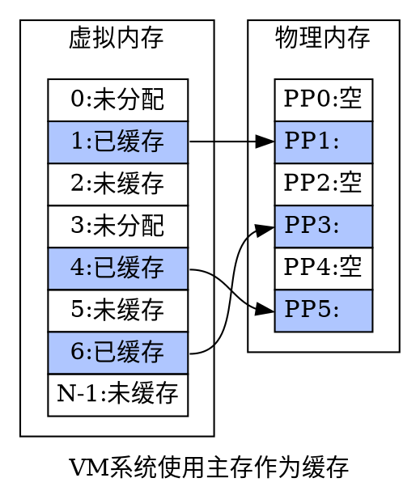

### DRAM缓存的组织架构

使用DRAM缓存来表示虚拟内存系统的缓存，在主存中缓存虚拟页。
由于大的不命中处罚以及访问第一个字节的开销，虚拟页一般比较大，通常是4KB-2MB, 同时DRAM是全相联的，即任何虚拟页可以对应任何的物理页。对磁盘访问时间很长，DRAM缓存使用写回而不是直写。

### 页表
页表(page table)用于记录虚拟页和物理页之间的映射，存放在物理内存中。
页表是一个页表条目的数组(Page Table Entry, PTE)的数组。每个PTE由一个有效位和n位地址字段组成，有效位表明虚拟页是否被缓存在DRAM中，如果设置了有效位，那么地址字段就表示DRAM中相应物理页的起始地址。如果没有设置有效位，这个地址指向虚拟页在磁盘上的起始地址。

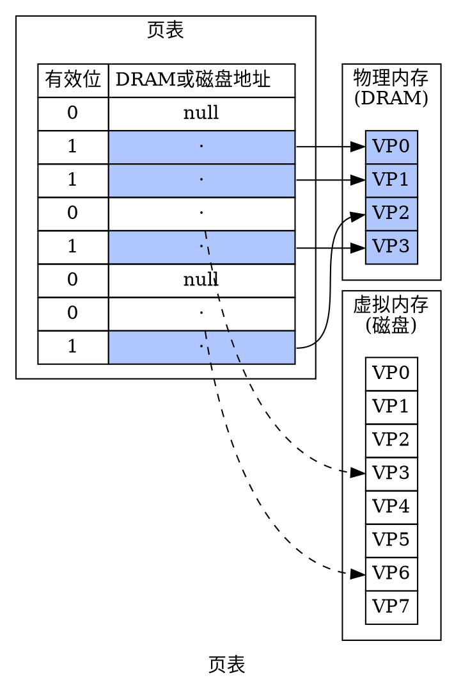

### 页命中
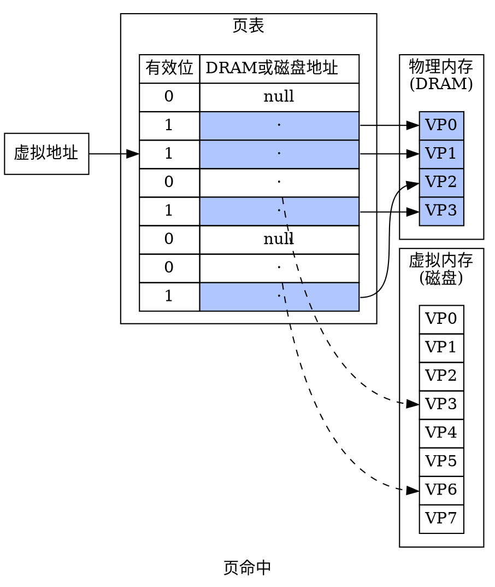
### 缺页
地址翻译硬件从内存中读取PTE3，从有效位推断VP3未被缓存，并触发一个缺页异常.

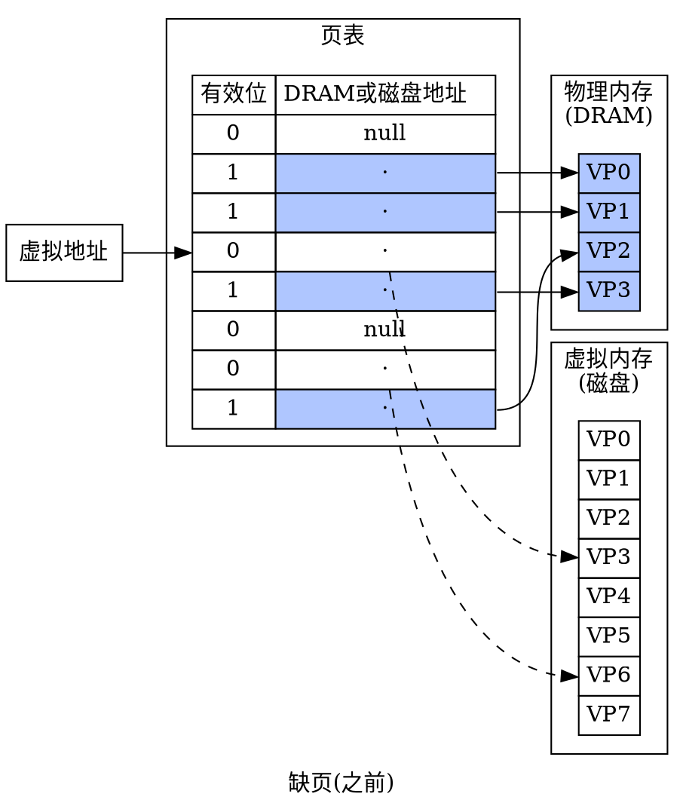

内核的缺页异常处理程序运行，选择一个牺牲页，选择VP3,内核捡起将其复制回磁盘，并更改页表的条目,更改完成后的状态：
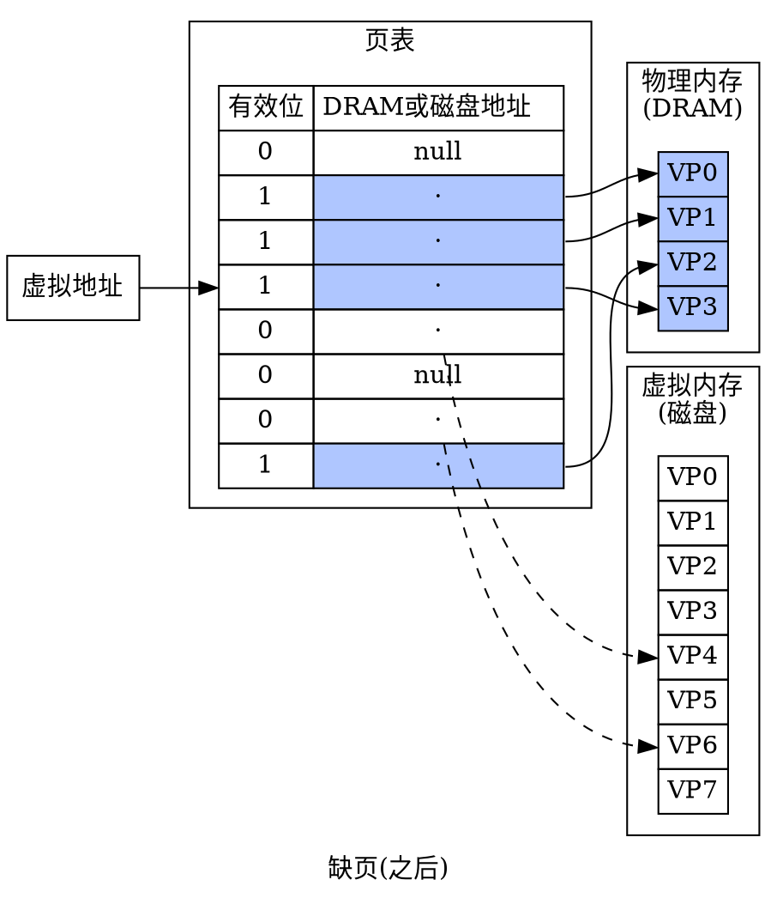

### 分配页面

分配页面发生的时机：如malloc函数

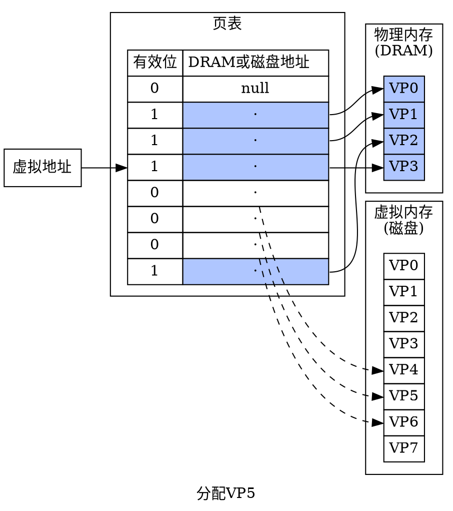
### 局部性原理

前面提到缺页时开销很大，但实际上虚拟内存运行的很好，原因还是局部性原理。

局部性原理保证了在任意时刻，程序将趋向于在一个较小的活动页面集合上工作，这个集合叫做工作集(working set)或者常驻集(resident set)。

如果工作集的大小超出了物理内存的大小，那么程序将处于抖动(thrashing)状态，页面将不断地换进换出。
> linux的getrusage可以检测缺页的数量。

## 虚拟内存作为内存管理的工具
虚拟内存同样也可以简化内存管理，并提供一种自然的保护内存的方法。
操作系统为每个进程提供一个独立的页表，即独立的虚拟内存空间。

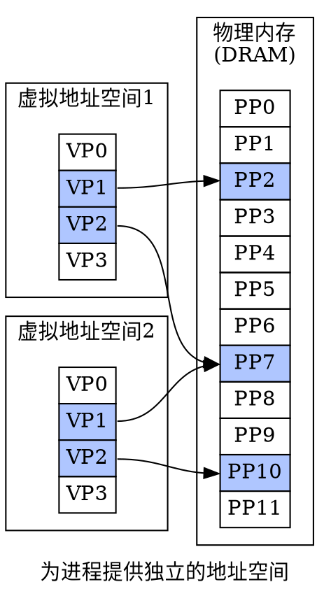

按需页面调度和独立的虚拟地址空间的结合，便于系统中内存的使用和管理：
* 简化链接：独立的地址空间允许每个进程的内存映像使用相同的基本格式，而不管代码和数据实际存放在物理内存的何处。
* 简化加载：虚拟内存使向内存中加载可执行文件和共享对象文件变得容易。要把目标文件中.text和.data节加载到一个新创建的进程中，linux加载器为代码和数据段分配虚拟页，把他们标记为无效，将页表条目只想目标文件中适当的位置。加载器从不从磁盘实际复制任何数据到内存。数据的复制发生在CPU取指令或正在执行的指令引用一个内存位置时，虚拟内存系统会按照需要自动的调入数据页。内存映射(memory mapping)， linux有一个mmap系统调用。
* 简化共享：每个进程必须调用相同的操作系统内核代码，比如printf，操作系统通过将不同的进程中适当的虚拟页面映射到相同的物理页面，从而安排多个进程共享这部分代码的一个副本，而不是在每个进程中都包括单独的内核和C标准库的副本。
* 简化内存分配：当用户进程请求额外的堆空间时，操作系统同一分配k个连续的虚拟内存页面，并将它们映射到任意位置的k个任意的物理页面，物理页面的分配不需要连续。

## 虚拟内存作为内存保护的工具

在PTE上添加额外的许可为来控制对一个虚拟页面的访问内容十分简单。
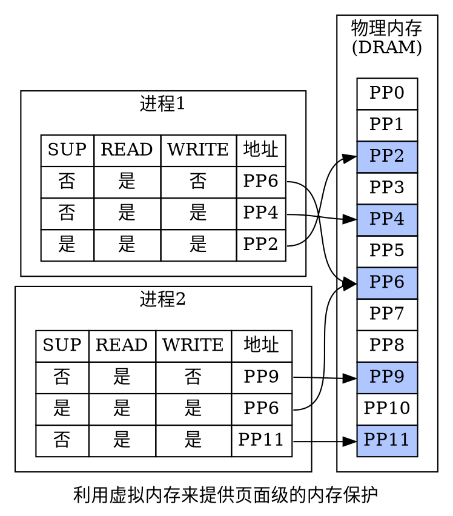

SUP表示运行在内核模式才能访问该页，READ和WRITE控制对页面的读和写。

如果一条指令违反了这些许可，那么CPU就会触发一个一般保护故障，将控制传递给一个内核中的异常处理程序。linux的异常报告为"段错误(segmentation-fault)".

## 地址翻译

地址翻译是一个N元素的虚拟地址空间(VAS)中的元素和一个M元素的物理地址空间(PAS)之间的映射。

```tex
MAP = VAS \to PAS \cup \empty
```
这里: <br/>

```tex
MAP(A) =\left\{ \begin{array}{cl} 
A' & 如果虚拟地址A处的数据在\text{PAS}的物理地址A'处\\ \empty & 如果虚拟地址A处的数据不在物理内存中
\end{array} \right.
```

**使用符号:**
* N=2<sup>n</sup>: 虚拟地址空间中的地址数量
* M=2<sup>m</sup>: 物理地址空间中的地址数量
* P=2<sup>p</sup>: 页的大小

* VPO: 虚拟页面偏移量(字节)
* VP: 虚拟页号
* TLBI: TLB索引
* TLBT:TLB标记

* PPO: 物理页面偏移量
* PPN:物理页号
* CO: 缓冲块的字节偏移量
* CI: 高速缓存索引
* CT: 高速缓存标记

MMU利用页表实现映射：
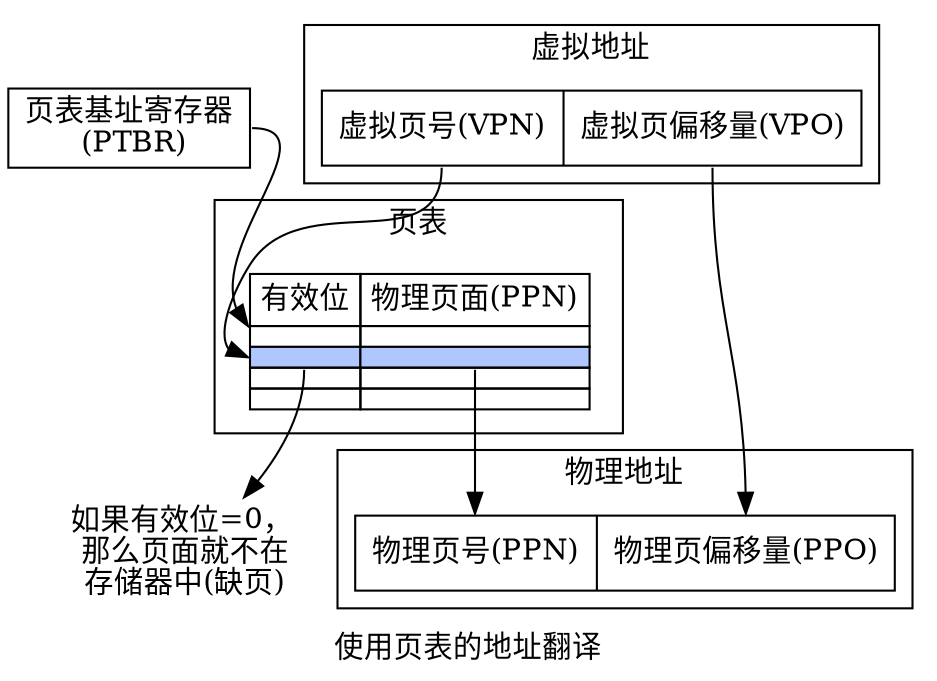

### 结合高速缓存和虚拟内存
页表条目可以缓存，就像其他的数据字一样.

一般来说缓存的是翻译后的物理地址，因为这样可以将多个进程的共享块缓存在同一个高速缓存块中。主要思路是地址翻译发生在高速缓存之前。

### 利用TLB加速地址翻译

TLB(Translation Lookside Buffer， TLB，翻译后备缓冲区)是在MMU中包括的一个关于PTE的小的缓存。

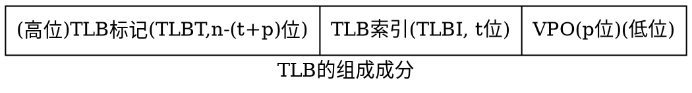
TLB tong通常又高度的相联度，用于组选择和行匹配的索引和标记字段是从虚拟地址中的虚拟页号中提取出来的，如果TLB有T=2<sup>t</sup>个组，那么TLB索引(TLBI)是由VPN的t个最低位组成，TLB标记(TLBT)是由VPN中剩余的位组成。

TLB命中时的情况：
1. CPU产生一个虚拟地址
2. MMU从TLB取出相应的PTE
3. MMU将这个虚拟地址翻译成一个物理地址，并将其发送到高速缓存/主存
4. 高速缓存/主存将所请求的数据字返回给CPU

TLB不命中时：
MMU必须从L1缓存中取出相应的PTE，新取出的PTE存放在TLB中，可能会覆盖一个已经存在的条目。

### 多级页表

如果只使用一个单独的页表来进行地址翻译，那么对于每一个32位的进程，总是需要一个4MB的页表项驻留在内存中，对于地址空间为64位来说，则需要更多。

用来压缩页表的常用方式是使用层次结构的页表。一级页表中的每个PTE负责映射虚拟地址中一个4MB的片(chunk)，这里每一片都是由1024个连续的页面组成,假设地址空间是32位，1024个PTE已经足够覆盖整个空间了。

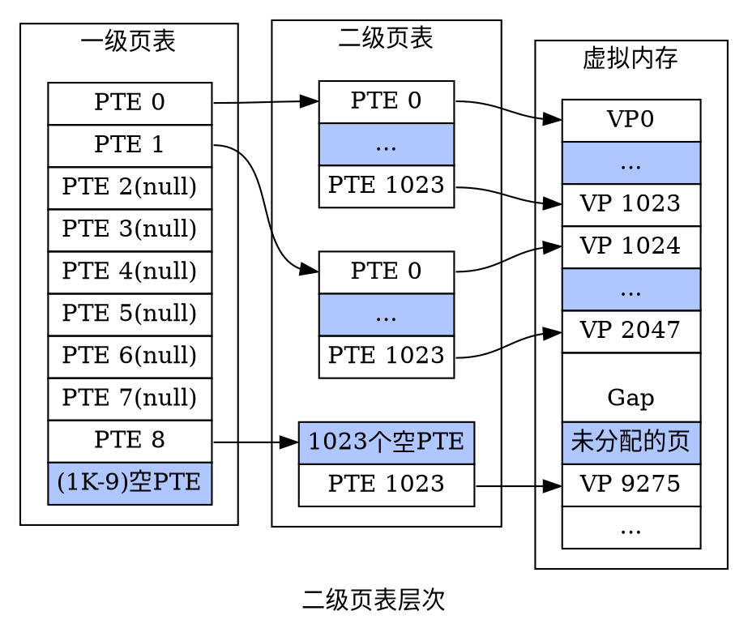

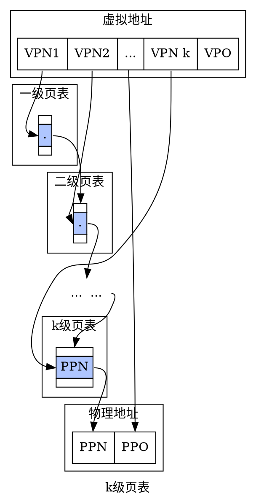

### 综合:端到端的地址翻译

感觉这里搞一个动画比较形象，目前还没弄。

## Intel Core i7/linux内存系统

### Core i7 地址翻译

### linux虚拟内存系统

## 内存映射

### 再看共享对象

### 再看fork函数

### 再看execve函数

### 使用mmap函数的用户级内存映射

## 动态内存分配

### malloc和free函数

### 为什么要使用动态内存分配

### 分配器的要求和目标

### 碎片

### 实现问题

### 隐式空闲列表

### 放置已分配的块

### 分割空闲块

### 获取额外的堆内存

### 合并空闲块

### 带边界标记的合并

### 实现一个简单的分配器

### 显示空闲链表

### 分离的空闲链表

## 垃圾收集

### 垃圾收集的基本知识

### Mark & Sweep垃圾收集器

### C程序的保守Mark & Sweep垃圾收集器

## C程序中常见的与内存有关的错误

### 间接引用坏指针

### 读未初始化的内存

### 允许栈缓冲溢出

### 假设指针和它们指向的对象是相同大小的

### 造成错位错误

### 引用指针,而不是它所指向的对象

### 误解指针运算

### 引用不存在变量

### 引用空闲堆块中的数据

### 引起内存泄露

## 小结


