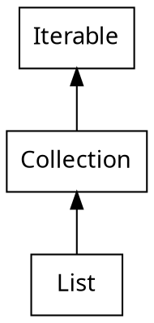

# List

> Java的一个接口 


常见的实现类有ArrayList和LinkedList, 在开发中使用得最多的是ArrayList

ArrayList大的底层数据结构是数组，LinkedList底层数据结构是链表。

## ArrayList

### ArrayList相较于数组的优势

1. ArrayList是可以动态扩容的: 原生的数组在创建时显示指定大小，而ArrayList不用。在日常开发过程中，我们往往是不知道数组大小的，如果数组大小指定多了，内存浪费，如果数组大小指定少了，又会溢出。


2. 另外ArrayList还带有边界检查
    ```java
    private void rangeCheckForAdd(int index) {
        if (index > size || index < 0)
            throw new IndexOutOfBoundsException(outOfBoundsMsg(index));
    }
    ```

### ArrayList的扩容方式

1. 当使用new ArrayList时，默认创建一个空的Object数组，大小为0
2. 第一次使用add 添加数据的时候，会给数组初始化一个大小，默认值是10
    ```java
    private static final int DEFAULT_CAPACITY = 10;
    ```
3. 在每一次add的时候，都会先去计算这个数组是否已满，如果空间未满，直接加，否则扩容
    ```java
    public boolean add(E e) {
        ensureCapacityInternal(size + 1);  // Increments modCount!!
        elementData[size++] = e;
        return true;
    }
    ```
4. 扩容时每次扩大到原来的1.5倍(向下取整，右移运算),实际调用的是`grow`方法，扩容之后将数据利用数组拷贝`Arrays.copyof`拷贝到新空间

    ```java
    private void grow(int minCapacity) {
        // overflow-conscious code
        int oldCapacity = elementData.length;
        int newCapacity = oldCapacity + (oldCapacity >> 1);
        if (newCapacity - minCapacity < 0)
            newCapacity = minCapacity;
        if (newCapacity - MAX_ARRAY_SIZE > 0)
            newCapacity = hugeCapacity(minCapacity);
        // minCapacity is usually close to size, so this is a win:
        elementData = Arrays.copyOf(elementData, newCapacity);
    }
    ```

### ArryList比LinkedList在业务开发中的优势

日常业务开发中很少在List中部位置插入删除操作，一般都是遍历加按位置取，增删操作一般在List的尾部，使用ArrayList比较好，同时ArrayList哪怕在中部位置增删，由于使用的`Arrays.copyof`方法，利用对内存的块操作，也不会有O(N)的复杂度，因此ArrayList使用的较多。

## Vector

Vector的底层结构也是数组，但已经比较少使用。

Vector的一大特点是线程安全的

在扩容时是直接扩容为2倍。

## CopyonWriteArrayList

> 在多线程的场景下，一般的集合都是线程不安全的。

### Collections.sync...

最简单的方式是使用Collections.syn···方法来对Collection加锁
```java
 public static <T> Collection<T> synchronizedCollection(Collection<T> c) {
    return new SynchronizedCollection<>(c);
}
```
实现原理就是几乎全部操作使用synchronized修饰
```java
public E get(int index) {
    synchronized (mutex) {return list.get(index);}
}
public E set(int index, E element) {
    synchronized (mutex) {return list.set(index, element);}
}
public void add(int index, E element) {
    synchronized (mutex) {list.add(index, element);}
}
public E remove(int index) {
    synchronized (mutex) {return list.remove(index);}
}

public int indexOf(Object o) {
    synchronized (mutex) {return list.indexOf(o);}
}
```

当然这样效率不高，毕竟是直接对操作方法整体加的锁。

更好的方式是使用juc包(`java.util.concurrent`)下对应的并发版本集合类。

CopyonWriteArrayList就是ArrayList的并发版本

### 写时复制(cow)

在linux中，所有的进程都是init进程fork出来的，
除了进程号，fork出来的进程默认和父进程一致，当使用了cow机制，子进程在fork之后exec之前，两个进程使用的是相同的内存空间，以意味着子进程的代码段、数据段、堆栈都是只指向父进程的物理空间，父子进程中试图针对私有内存进行写操作时，会引发一个保护故障进行复制并更改页表条目。

写时复制充分利用的虚拟内存的特性，可以减少分配或复制大量资源时带来的瞬时延迟。

写时复制宏观上看来就是懒加载或单例模式的懒汉式。

文件系统也有写时复制机制。

### CopyOnWriteArrayList的实现

add()方法实际上使用了一个ReentrantLock，会复制一个新的数组，往数组里面add真正的元素，最后吧array的指向改变成新的数组。

get()方法和size()方法只是获取array所指向的数组元素或大小，读不加锁、写加锁。

```java
public boolean add(E e) {
    final ReentrantLock lock = this.lock;
    lock.lock();
    try {
        Object[] elements = getArray();
        int len = elements.length;
        Object[] newElements = Arrays.copyOf(elements, len + 1);
        newElements[len] = e;
        setArray(newElements);
        return true;
    } finally {
        lock.unlock();
    }
}
```

### CopyOnWriteArrayLlist的缺点

1. 耗费内存：每次set()/add()都会复制一个数组出来
2. COWArrayList只保证数据的最终一致性，不保证数据的实时一致性

    :warning: 线程A读取CopyOnWriteArrayList的数据，没读完，线程B把List清空了，线程A此时还是可以把剩余的数据读出来。


