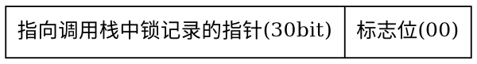
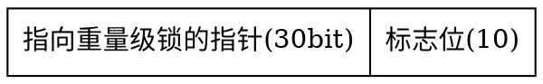
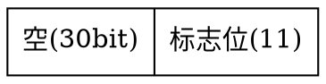
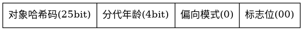
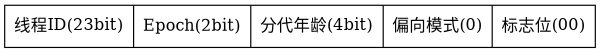

# synchronized

> Java的一个关键字，更够将代码块/方法锁起来，这是一种互斥锁，即一次只允许一个线程进入被所指的代码块。

## synchronized锁的对象

主要看synchronized修饰的是什么方法：
* 如果是实例方法，对应的锁是当前实例对象
* 如果是静态方法，对应的锁是当前类的class对象
* 如果是代码块，对应的锁是传入synchronized的对象

## synchronized的原理

当使用synchronized  修饰方法时，会在flags上给予ACC_SYNCHRONIZED标识(就是将这位置置为1)，可用过javap查看，比如以下方法
```java
private synchronized void syncMethod() {
    System.out.println("syncMethod");
} 
```
编译成class文件之后，映射class文件如下：
```java
private synchronized void syncMethod();
    descriptor: ()V
    flags: ACC_PRIVATE, ACC_SYNCHRONIZED
    Code:
      stack=2, locals=1, args_size=1
         0: getstatic     #2                  // Field java/lang/System.out:Ljava/io/PrintStream;
         3: ldc           #3                  // String syncMethod
         5: invokevirtual #4                  // Method java/io/PrintStream.println:(Ljava/lang/String;)V
         8: return
```
当修饰代码时块是，会依赖`monitorenter`和`monitorexit`指令
一个简单含有synchronized代码块的方法
```java
public static void main(String[] args) {
        synchronized (Main.class) {
            System.out.println("hello World!");
        }
    }
```
对应的class文件
```java
public static void main(java.lang.String[]);
    descriptor: ([Ljava/lang/String;)V
    flags: ACC_PUBLIC, ACC_STATIC
    Code:
      stack=2, locals=3, args_size=1
         0: ldc           #5                  // class Main
         2: dup
         3: astore_1
         4: monitorenter
         5: getstatic     #2                  // Field java/lang/System.out:Ljava/io/PrintStream;
         8: ldc           #6                  // String hello World!
        10: invokevirtual #4                  // Method java/io/PrintStream.println:(Ljava/lang/String;)V
        13: aload_1
        14: monitorexit
        15: goto          23
        18: astore_2
        19: aload_1
        20: monitorexit
        21: aload_2
        22: athrow
        23: return
```

但以上两种方式都只是标记这个方法应该被锁上，而锁的实际存在位置是在对应的对象上(class对象或实例对象)，锁的操作与对象的存储方式有关。

在内存中，对象一般由三部分组成,分别是对象头、对象实际数据和对其填充。

其中与锁相关的就是对象头的中的`Mark Word`信息，`Mark Word`会记录对象当前有关锁的状态，同时对于执行了锁操作的对象，会有一个对应的monitor对象来存储当前持有所锁的线程和等待锁的线程。

## Mark Word


对象的Mark Word其实就是一个32bit大小的一块内存（在64位虚拟机上是64位），用来表示对象自身的运行时数据，为了节省空间，通过2bit的标志位来记录不同的信息（就是标志位不同，其他bit代表的意义不同）

<!-- tabs:start -->
#### **00**
轻量级锁定

mark word各个bit的含义如下

#### **10**
重量级锁定

mark word各个bit的含义如下

#### **11**
GC标记

mark word各个bit的含义如下

#### **01**
01的情况有两种，主要看偏向模式是否为1

偏向模式为0则是未锁定，对象头表示正常的信息


偏向模式为1则是可偏向，对象头表示偏向线程信息

<!-- tabs:end -->

## 重量级锁

在JDK1.6之前，synchronized是重量级锁,一旦进入同步代码块/方法会生成锁，并在mark word中记锁的指针（哪怕此时只有一个线程），重量级锁的生成是依赖操作系统的内核的mutex互斥指令实现的，因此每次进入和离开同步代码块都会调用加锁解锁操作，都有用户态和内核态的切换，性能损耗明显。

重量级锁其实就是将锁状态的维护完全交给内核来实现，自然就比较慢。

## 轻量级锁

轻量级锁的出发点是大多数情况下不会发生竞争，一个线程进入同步代码块然后执行完毕，没有必要非得通知内核来上锁。它的实现方式是在当前线程的栈帧中，复制一份mark word的信息，然后通过CAS的方式来将mark word从01未锁定转变为00轻量级锁定，当同步代码块执行完成后通过CAS将mark word更改回来，期间如果有其他线程尝试获取轻量级锁定的对象，直接升级为重量级锁并创建等待队列。之所以使用CAS是防止多个线程同时更改mark word。

轻量级锁可以做到在没有竞争的情况下，完全不需要访问内核，只需要在用户空间进行数据的拷贝(mark word)，在大多是情况下性能更好。

## 偏向锁

偏向锁是一个可选的锁优化措施，目的在于消除数据在无竞争情况下的同步原语（就是在没有竞争的时候, 我这种菜鸟随便对方法添加synchronized也基本不会影响性能了！）

相比于轻量级锁每次进出同步方法块头需要使用CAS更改mark word信息，偏向锁只有在第一次进入同步代码块时会更改mark word信息，之后的线程进入同步代码块时只需判断mark word中的线程Id是否与当前线程id相等，如果相等，表明是同一不需要进行任何同步操作，如果不等，则表明是其他线程尝试获取锁，此时更根据锁对象是否被锁定来退回到未锁定或轻量级锁定状态，然后执行各自状态的语义。

偏向锁不依赖栈帧中的额外空间存储信息，相反使用了对象哈希码的空间，同时，原生Object::hashcode是个不可逆的操作，如果利用原生函数计算了hashcode，那么就不能进入偏向锁状态，已经处于偏向锁状态的对象一旦调用原生hashcode方法会直接锁膨胀为重量级锁。

偏向锁默认开启。可以通过数`-XX：-UseBiased Locking`关闭

## 几种锁的区别

锁只有升级，没有降级。

不同锁的运行情况：
* 只有一个线程进入临界区：偏向锁
* 多个线程交替进入临界区：轻量级锁
* 多个线程同时进入临界区，重量级锁


