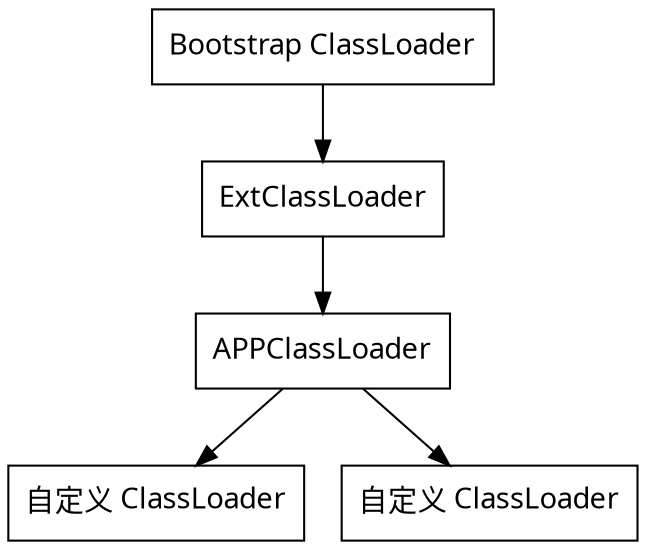
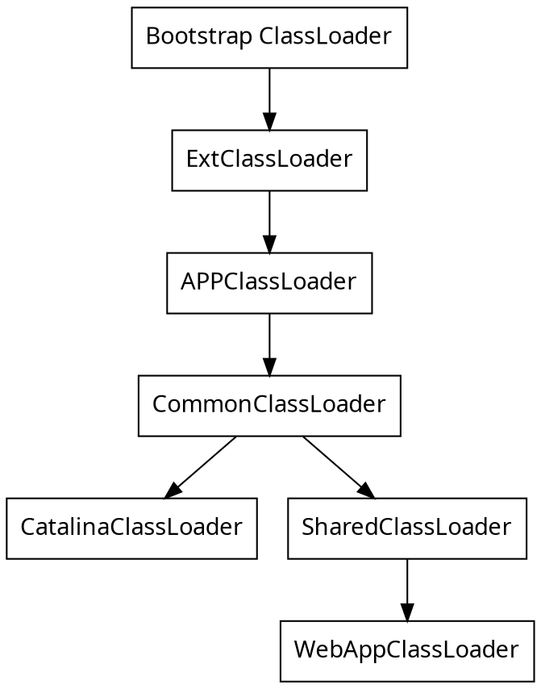

# 双亲委派机制

> Parent delegation mechanism

## 类加载器

class文件是通过类加载器装载到JVM中的, 为了防止用户覆盖Java的核心类，使用双亲委派机制，不会首先尝试自己加载这个类，而是请求委托父类加载器去完成加载，依此向上。

JDK1.8中的核心方法类(`jre/lib/*.jar`)由根载器(Bootstrap loader)装载，JDK中内部实现的扩展类`jre/lib/ext/*.jar`由扩展加载器(ExtClassLoader)装载，程序中的类文件由系统加载器(AppClassLoader)实现装载。



## 打破双亲委派机制

> 让加载类的时候不是从APPClassLoader->ExtClassLoader->BootstrapClassLoader的顺序找就算是打破了。

双亲委派机制向上查找的是实现：
```java
protected synchronized Class<?> loadClass(String name, boolean resolve) throws ClassNotFoundException { 
    // 首先，检查请求的类是否已经被加载过了
    Class c = findLoadedClass(name); 
    if (c == null) { 
        try { 
            if (parent != null) { 
                c = parent.loadClass(name, false); 
            } 
            else { 
                c = findBootstrapClassOrNull(name); 
            }
        } catch (ClassNotFoundException e) { 
            // 如果父类加载器抛出ClassNotFoundException 
            // 说明父类加载器无法完成加载请求 
        }
        if (c == null) { 
            // 在父类加载器无法加载时 
            // 再调用本身的findClass方法来进行类加载 
            c = findClass(name); 
        } 
    }
    if (resolve) { 
        resolveClass(c); 
    }
    return c; 
}
```
因此实现一个ClassLoader，并且重写loadCLass方法，不先让父类查找即可。

经典场景：`Tomcat`应用

我们知道一个Tomcat应用可以同时运行多个Web应用程序。

如果每个都有一个应用都有一个org.example.User类，但是类的实现又不一致，显然不能只选取一个加载进JVM中，而是要不同的应用有不同的Class对象，因此Tomcat就自定义了一个`WebAppClassLoader`，重写了loadClass方法，优先加载当前应用目录下的类，如果找不到了，在一层一层往上找，实现了Web应用级的隔离。


## Tomcat的类加载器

由于并不是所有的web应用程序下的所有依赖都是隔离的，比如依赖的中间包如果版本相同是可以共享的，没有必要每个应用都独自加载一份。

因此，Tomcat除了WebAppClassLoader以外，在其上有一个`SharedClassLoader`，如果WebAPPClassLoader自身没有加载到某个类，就委托SharedClassLoader去加载，相当于SharedClassLoader用于加载Web应用的依赖包中的类。

不过这里有个小问题，由于WebAPPClassLoader是先自己加载再向上查找，那我可不可以自己写一个Java.lang.Object放到tomcat中使用:thinking:。

结论是不可以：因为我们说加载的前提是自己找不到类再向上考虑怎么加载，但核心库类和扩展类在TomCat启动时就已经加载进JVM中了，因此是可以找到的，就不会考虑加载了，所以Tomca也有类加载`CatalinaClassLoader`，同时也可以和SharedClassLoader复用，因此有一个`CommonClassLoader`.

综上，Tomcat的类加载示意图为：


## JDBC是否破环了双亲委派机制

> 有没有破环，不好定义，直接看实现方式

JDBC定义了接口(`DriverManager`, 属于`java.sql`包，属于核心类，使用bootstrapClassLoader加载)，具体实现有各个厂商进行实现(Mysql, postgresql),这就意味着肯定有不同的包(属于应用程序包，应该用`APPClassLoader`进行加载)

但是类加载还有一个规则：如果一个类由类加载器A加载，那么这个类的依赖类也由相同的类加载器加载。
```java
ClassLoader callerCL = caller != null ? caller.getClassLoader() : null;
```
按照双亲委派机制，BootstrapClassLoader发现class没有加载，于是先让父类加载，没有父类于是自己加载，这就出问题了，自己也找不到呀。

因此DriverManager的解决方案是在DriverManager创建连接的时候，主动通过`Thread.currentThread().getContextClassLoader()`获取一个`线程上下文加载器`，(原始线程的上下文加载器通常设置为用于加载应用程序的类加载器，其实就是BootstrapClassLoader加载不到，找一个可以加载的APPClassLoader来加载就好了)。
```java
synchronized(DriverManager.class) {
    // synchronize loading of the correct classloader.
    if (callerCL == null) {
        callerCL = Thread.currentThread().getContextClassLoader();
    }
}
```
所以我个人感觉这是没有破环双亲委派机制，毕竟也是从BootStrap向下尝试加载的。
