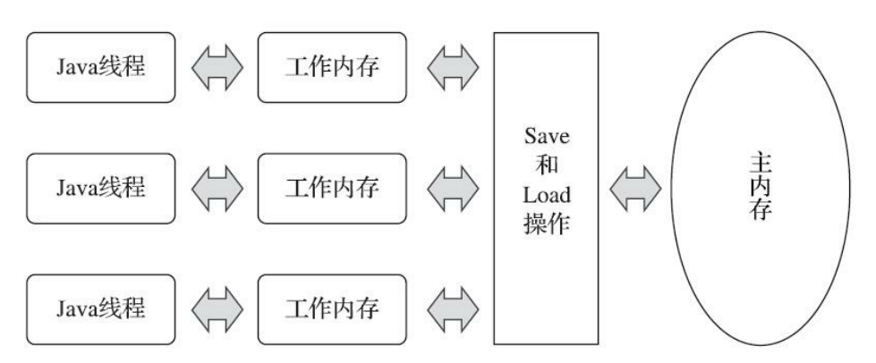

# Java内存模型

## 缓存不一致问题

- 计算机往往是多核的，每个核心会有高速缓存(解决CPU与主存速度存在的差异)，L1,L2高速缓存一般是每个核心独占一份。
- 为了让CPU提高执行运算效率，处理会对指令进行流水线拆解处理或者乱序指令重排。
- 一次对数据的修改往往是非原子性的，比如++，需要先将之读入cpu，加1，再写回主存。

以上几点同时出现，就会导致多线程可能出现问题，比如之前说的++操作，线程1在CPU核心上将变量++，然后线程2在另一个核上读取，但由于L1缓存不共享，如果线程1还没有将其写入主存，导致线程2读到的是以前的旧值，就会引发问题。

## 解决缓存不一致问题

1. 使用总线锁：某个核心在修改数据的过程中，其它核心均无法修改内存中的数据。
2. 缓存一致性协议：比如MESI(Modified、Exclusive、Share、invalid)，针对不同核心中对应的缓存行加锁。
    - Modifid：说明当前CPU正在修改该变量的值，同时会向其他CPU发送该数据状态invalid的通知，其他CPU响应之后会将其数据状态变为无效，当前CPU将数据写到主存(异步写的)，并将状态从modify修改成exclusive
    - Exclusive: 辨明当前CPU将要得到的是变量数据是最新的，没有被其他CPU所同时读取
    - Share: 说明当前CPU正在读取的变量还是族最新的，有其他CPU在同时读，但还没有修改。
    - invalid：表示需要从主存重新读取最新二数据。

## 内存屏障

内存屏障主要就是为了解决乱序执行以及缓存不及时可见的问题。

内存屏障可以分为三种类型：写屏障、写屏障、以及全能屏障(读写屏障)

屏障其实就是一条特殊的指令，只要遇到这条指令，处理器要保证之前的操作都得完成，然后在执行之后的指令。

同时写屏障保证高速缓存中修改了的数据必须写入主存，读屏障将缓存未修改中的数据清空，保证下一次从主存读取最新值。

通过这种方式保持CPU缓存状态的准确。

## Java内存模型出现的原因

不同CPU架构的缓冲体系不同，缓存一致性协议不同、重排策略不同，所提供的内存瓶中指令也有差异，为了简化开发人员的工作，Java及封装了一套Java内存规范。

Java内存模型希望屏蔽各种硬件和操纵系统的访问差异，保证了Java程序在各种平台下对内存的访问都能得到一致的效果，目的是解决多线程存在的原子性、可见性、以及有序性问题。

## Java内存模型的结构

- lock
- unlock
- read
- load
- use
- assign
- store
- write

## happen-before规则

为了避免繁杂的手动设置一次常见的禁止重排，jvm支持happen-before规则：JVM会保证这些语义的正确执行

- 程序次序规则：在一个线程中，控制流书写在前的操作发生在书写在后的操作
- 管程锁定规则；一个unlock操作先行发生于后面对同一个锁的的lock操作。
- volatile变量规则：对一个volatile变量的写操作先行发生与后面对这个变量的读操作
- 线程启动规则：start()方法先行发生与此线程的每一个动作
- 线程终止规则：线程中的所有操作都先行发生于此线程的终止检测
- 线程中断规则：对线程interrupt()方法的调用先行发生于被中断线程 的代码检测到中断事件的发生，可以通过Thread::interrupted()方法检测到是否有中断发生。
- 对象终结规则：一个对象的初始化完成（构造函数执行结束）先行发生于它的 finalize()方法的开始。
- 传递性： 如果操作A先行发生于操作B，操作B先行发生于操作C，那就可以得出操作A先行发生于操作C的结果

## volatile语义

volatile保证了内存的可见性和有序性，实际上通过在对volatile的赋值加上内存屏障来实现的。

实际对应的汇编指令可能(取决于机器)是`lock addl $0x0,(%esp)`，lock的的作用是将本处理器的缓存写入了内存，该写入动作也会引起 别的处理器或者别的内核无效化（Invalidate）其缓存。在java模型中就是store和write。

