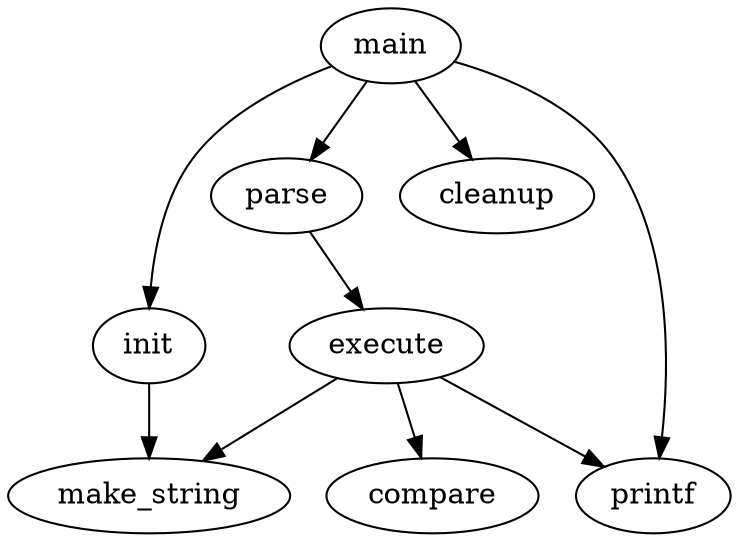
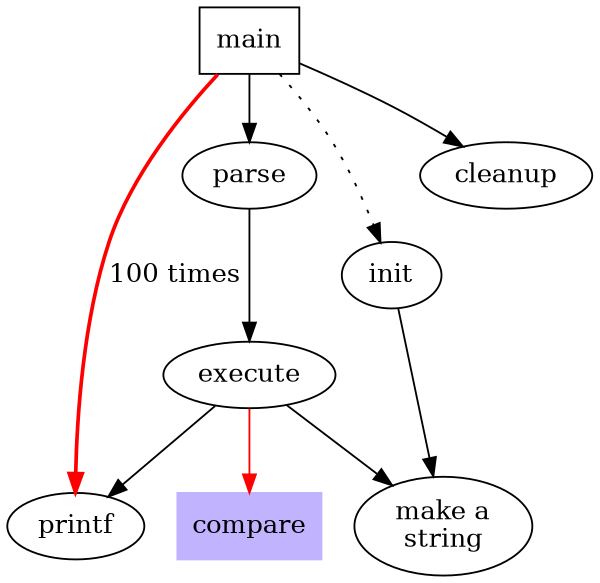
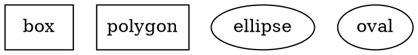
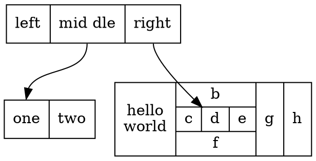
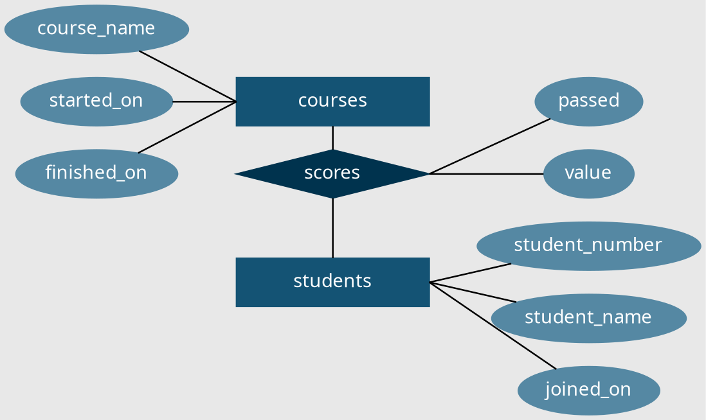
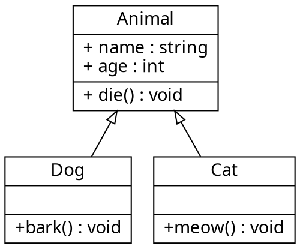

# Dot

Graphviz 是一个由 AT&T 实验室启动的开源工具包，用于绘制 dot 语言脚本描述的图形。 类似微软的 visio，但是他和 visio 也有很大的不同，他是用代码绘图的，使用一种名 为 dot 的语言绘图，对于绘制复杂的流程图，类图等非常好用。 这种设计使得用户更关 注于逻辑关系，实现 "所思即所得"。Graphviz 的自动布局功能，无需人为干预就可以做 到 "最小化连线交叉"

dot可以生成GIF, PNG, SVG, PDF和PostScript格式的图片，画图的类别分为有向图和无向图。

## 基本画图

### 图的基本元素

图中包含以下常见要素：
* node 节点
* edge 边
* subgraph 子图
* attr 属性

<!-- tabs:start -->
#### **Code**
```
digraph basicGraph {
    main -> parse -> excute;
    main -> init;
    main -> cleanup;
    execute -> make_string;
    excute -> printf;
    init -> make_string;
    main -> printf;
    execute -> compare;
}
```
#### **Output**

<!-- tabs:end -->

### 图的基本属性

绘制图时可以设置节点的边的属性：

<!-- tabs:start -->
#### **Code**
```
digraph graphAttrs {
  size ="4,4";
  main [shape=box];   /* this is a comment */
  main -> parse [weight=8];
  parse -> execute;
  main -> init [style=dotted];
  main -> cleanup;
  execute -> { make_string; printf}
  init -> make_string;
  edge [color=red];   // so is this
  main -> printf [style=bold,label="100 times"];
  make_string [label="make a\nstring"];
  node [shape=box,style=filled,color=".7 .3 1.0"];
  execute -> compare;
}
```
#### **Output**

<!-- tabs:end -->

* size 设置图片大小(单位英寸)
* 结点和边的属性写在方括号里
* shape=box设置节点形状为方框
* 花括号表示一个节点连接多个节点
* 节点和边可以使用label属性来设置

## 图的属性介绍

### 节点形状

节点的默认形状为`shape=ellipse, width=0.75, height=0.5`,节点的名字为默认label, 更多形状参见[shapes](http://www.graphviz.org/doc/info/shapes.html)

<!-- tabs:start -->
#### **Code**
```
digraph graphAttrs {
  box[shape=box];
  polygon[shape=polygon];
  ellipse[shape=ellipse];
  oval[shape=oval];
}
```
#### **Output**

<!-- tabs:end -->

* 节点形状分为两类polygon-based和record-based和record
* polygon-based直接用作形状
* record-based可以用作递归定义

<!-- tabs:start -->
#### **Code**
```
digraph graphLabel {
  node [shape=record];
  struct1 [label="<f0> left|<f1> mid\ dle|<f2> right"];
  struct2 [label="<f0> one|<f1> two"];
  struct3 [label="hello\nworld |{ b |{c|<here> d|e}| f}| g | h"];
  struct1:f1 -> struct2:f0;
  struct1:f2 -> struct3:here;
}
```
#### **Output**

<!-- tabs:end -->
* `|`用力分隔域
* `<>`标识 field<sub>id</sub> 
* label中的空格和换行需要转义

## 实例

### ER图

<!-- tabs:start -->
#### **Code**
```
graph ER_Diagram {
  rankdir="LR";
  bgcolor="#e8e8e8";
  compound=true;
  splines=false;

  node [fontname="Helvetia"; fontcolor="#ffffff"]

  node [shape=ellipse, style=filled, color="#5588a3"];
  student_number; student_name; joined_on;
  course_name; started_on; finished_on;
  value; passed;

  node [shape=box, style=filled, color="#145374", width=2];
  courses; students;

  node [shape=diamond, color="#00334e"];
  scores;

  edge[color="#000000", penwidth=1.2];
  {course_name; started_on; finished_on} -- courses:w ;
  scores:e -- {value; passed};
  students:e -- {student_number; student_name; joined_on};
  {
    rank=same
    courses -- scores -- students;
  }
}
```
#### **Output**

<!-- tabs:end -->

### 类图

<!-- tabs:start -->
#### **Code**
```
digraph classDiagram {
  rankdir=TB;
  fontname="Helvetia";
  node[shape="record"; fontname="Helvetia"];
  edge[fontname="Helvetia", dir=back; arrowtail=empty;];

  animal [label="{Animal|+ name : string\l+ age : int\l|+ die() : void\l}"];
  dog [label="{Dog| | +bark() : void\l}"];
  cat [label="{Cat| | +meow() : void\l}"];

  animal -> dog;
  animal -> cat;
}
```
#### **Output**

<!-- tabs:end -->

[了解更多](https://jeanhwea.github.io/article/drawing-graphs-with-dot.html)

